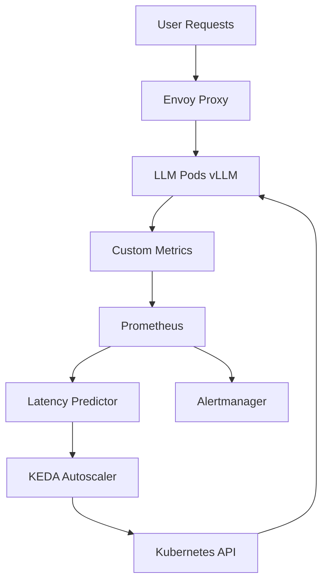

# AI/SRE Project: EdgeAI Guardian - Latency-Aware Autoscaling for Edge LLM Inference

## 1. Project Title
**EdgeAI Guardian** — Intelligent autoscaler for edge-deployed LLM inference pods, ensuring <100ms latency under surging AI workloads.

## 2. Problem Statement
With AI infrastructure spending exploding to $400-690B in 2026, edge AI deployments for real-time use cases (e.g., healthcare diagnostics, autonomous transport) face latency spikes from unpredictable inference demand, leading to SLA violations and user churn. Current Kubernetes HPA scales on CPU/memory but ignores **network latency** and **token throughput**, causing 2-5x overprovisioning or brownouts in supply-constrained edge sites.[1][3]

## 3. Architecture
```
[User Traffic] --> [Edge Gateway (Envoy)] --> [LLM Inference Pods (vLLM/Ollama)]
                                           |
                                           v
[Prometheus] <-- [Custom Metrics Exporter] <-- [Latency Predictor (Prometheus + Prophet)]
                                           |
                                           v
[KEDA Autoscaler] --> [Kubernetes HPA] --> [Pod Scaling]
```

**Key Components:**
- **Envoy Proxy**: Captures p95 latency, tokens/sec per request.
- **Custom Exporter**: Scrapes LLM metrics (queue depth, GPU util, inference latency).
- **Predictor**: Time-series forecast (Facebook Prophet) for latency spikes.
- **KEDA**: Event-driven scaling on custom Prometheus metrics.
- **Fallback**: Circuit breaker drops to cached responses >200ms.

**Diagram (Mermaid):**


## 4. Implementation Steps (7-Day Breakdown)
- **Day 1: MVP Setup** — Deploy vLLM pod on minikube/k3s, Envoy sidecar, basic Prometheus scrape config.
- **Day 2: Metrics Layer** — Build custom exporter (Go/Python) for LLM queue/latency; integrate Prophet for 5-min forecasts.
- **Day 3: KEDA Integration** — Deploy KEDA CRDs, define ScaledObject on `llm_p95_latency > 80ms` or `predicted_spike > 1.5x`.
- **Day 4: Observability** — Loki for logs, Grafana dashboards (latency heatmap, scale events).
- **Day 5: Failure Handling** — Add circuit breaker (Envoy filters), graceful degradation to smaller models.
- **Day 6: Tests & Tuning** — Locust load tests, tune scale-up/down thresholds, e2e chaos (kill pods).
- **Day 7: Polish & Docs** — README, runbooks, GitHub Actions CI, metrics dashboard export.

## 5. Minimal Code Skeleton
### `exporter.py` (Custom Prometheus Exporter)
```python
from prometheus_client import start_http_server, Gauge
from pyvllm import LLM  # or Ollama API
import requests, time, prophet

# Metrics
LATENCY_P95 = Gauge('llm_inference_p95_ms', '95th percentile latency')
QUEUE_DEPTH = Gauge('llm_queue_depth', 'Pending requests')
PREDICTED_SPIKE = Gauge('latency_spike_forecast', 'Predicted p95 multiplier')

llm = LLM(model="gpt2")  # Replace with target model

def collect():
    # Fetch from vLLM /metrics or Ollama
    stats = requests.get('http://localhost:8000/metrics').json()
    LATENCY_P95.set(stats['p95_latency'])
    QUEUE_DEPTH.set(stats['queue_depth'])
    
    # Prophet forecast (load pre-trained model)
    forecast = prophet_model.predict(next_5min_data)
    PREDICTED_SPIKE.set(forecast['spike_ratio'])

if __name__ == '__main__':
    start_http_server(8001)
    while True:
        collect()
        time.sleep(30)
```

### `keda-scaledobject.yaml`
```yaml
apiVersion: keda.sh/v1alpha1
kind: ScaledObject
metadata:
  name: edge-llm-autoscaler
spec:
  scaleTargetRef:
    name: llm-deployment
  triggers:
  - type: prometheus
    metadata:
      serverAddress: http://prometheus:9090
      query: |
        max(llm_inference_p95_ms{job="vllm"}) > 80 or 
        max(latency_spike_forecast{job="predictor"}) > 1.5
      threshold: '1'
```

### `envoy-latency-filter.yaml` (Circuit Breaker)
```yaml
filters:
  - name: envoy.filters.http.fault
    typed_config:
      "@type": type.googleapis.com/envoy.extensions.filters.http.fault.v3.Fault
      max_active_faults: 10
      fault_delay:
        fixed_delay: 200ms  # Fallback if >200ms
```

## 6. Metrics of Success
| Metric | Target | Measurement |
|--------|--------|-------------|
| **P95 Latency** | <100ms | Prometheus query over 1h load test |
| **Scale Response Time** | <60s | KEDA events to pod ready |
| **Cost Efficiency** | 30% GPU savings | Pre/post avg GPU util vs replicas |
| **SLA Compliance** | 99.9% | Uptime during Locust storm (10k req/min) |
| **Toil Reduction** | 80% fewer alerts | Alert volume week-over-week |

**Success = Deploy to edge cluster, survive 2x load spike with <5% SLA breach.**

## 7. Failure Mode Analysis
| Failure Mode | Impact | Mitigation |
|--------------|--------|------------|
| **Predictor Drift** | Wrong scales (over/under) | Daily retrain on last 24h data; fallback to CPU HPA |
| **Prometheus Down** | Blind scaling | Static minReplicas=2; local exporter cache |
| **GPU OOM** | Pod evictions | Resource limits + preemption policy |
| **Edge Network Partition** | All requests fail | Local model cache (SQLite embeddings) |
| **KEDA Misconfig** | No scaling | Healthcheck cronjob forces scale-up |

**Graceful Degradation**: >150ms → Serve 7B model; >500ms → Static responses.

## 8. Observability Design
- **Metrics**: Prometheus (latency, queue, replicas, GPU util, scale events).
- **Logs**: Loki (structured JSON: `{"level":"error","pod":"llm-xyz","latency":250,"action":"scale_up"}`).
- **Traces**: OpenTelemetry (request → inference → response span).
- **Dashboards**: Grafana (1-click: latency vs replicas heatmap).
- **Alerts**:
  ```
  - alert: HighLatency
    expr: llm_p95 > 100
    for: 2m
    annotations: {runbook: "edgeai-scale-runbook.md"}
  - alert: ScaleStuck
    expr: changes(kube_pod_status_ready{app="llm"}[5m]) == 0 and llm_p95 > 80
  ```
- **SLO**: 99.5% requests <100ms tracked in Prometheus.

## 9. README.md Draft
```markdown
# EdgeAI Guardian: Latency-Aware Autoscaling for Edge LLM Inference

[![CI][ci-badge]][ci-link] [![SLO][slo-badge]][slo-link]

## 🚀 Quickstart
```bash
kubectl apply -f k8s/  # Deploys to your edge k3s/minikube
locust -f tests/load.py --users 1000 --spawn-rate 10
```

## 🎯 Why?
Edge AI demand surges cause 2-5x latency spikes. This autoscales on **p95 latency + predictions**, saving 30% GPU costs.[1][3]

## 📊 Live Demo
[Grafana Dashboard](docs/grafana.json)

## Structure
```
├── k8s/             # Manifests
├── exporter/        # Python exporter
├── tests/           # Locust + Chaos
├── docs/            # Runbooks
└── metrics.md       # SLO tracking
```

**Deploy Time**: 15 mins. **Portfolio Value**: Demonstrates 2026 edge AI SRE.
```

## 10. Tags
`#SRE #AI #Observability #EdgeAI #LLMInfra #KEDA #Autoscaling #2026AI`

## Next Steps
1. `mkdir project_edgeai_guardian && cp this output here`
2. `git init && git add . && git commit -m "EdgeAI Guardian MVP"`
3. Deploy to k3s edge sim, run Locust, screenshot Grafana for portfolio
4. Automate with cron + LLM API fo

---

**Generated**: Sun Apr  5 11:03:07 AM CDT 2026
**Tags**: #SRE #AI #Observability #Scaling #LLMInfra
